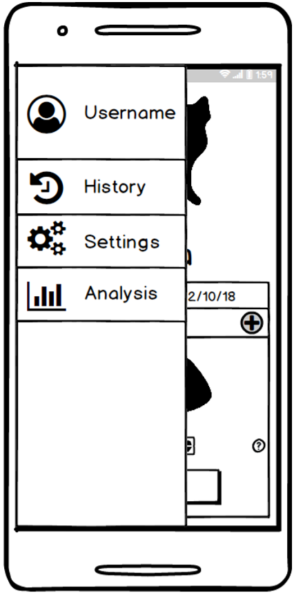

# Software Requirements Specification
---
## 1 Introduction
### 1.1 Purpose
  This document is written by business analyst and is intended for software developers , managers and customers to formalize and understand product requirement.
Developers use SRS to carry out tasks according to requirements. Managers use it to monitor progress of the project and to allocate tasks.
Customers should approve this document for futher check of fulfillment of the requirements.
### 1.2 Scope
  Developing application is named as **FeedMe.** It provides an opportunity to feed pet throught the Internet using mobile phone (Android).
  This application is designed for real device which based at your home and connected to the Internet. 
### 1.3 Business Requirements
### 1.4 Analogues
Main difference is a used device. Also in **FeedMe** presents history of feeding and statistics of spent food and money.
- [PetTec](https://play.google.com/store/apps/details?id=cn.xlink.pettec)
  - Device has weight sensor therefore application can monitor amount of remaining feed.
- [FunPaw Pet Feeder](https://play.google.com/store/apps/details?id=com.jyd.hk)
  - Device has a camera therefore application can broadcast live video of feeding and make snapshots.
  - Device has a dymanic therefore application can send voice messages while feeding.
- [JemPet](https://play.google.com/store/apps/details?id=com.jyd.hk)
  - Device has a camera also.
## 2 User Requirements
### 2.1 Software Interfaces
  **FeedMe** is dependent component of the system. The application should be able to manage device which is based at user's home. 
  Management should be carried out through the MQTT-broker or server. 
  - MQTT-broker is a [Cloud MQTT](https://www.cloudmqtt.com/) - hosted message broker for the Internet of Things. 
  - **FeedMe** is a appilacion installed on client's phone that provides control. Application will send requests to the MQTT-broker. Broker will send this request to the device and device will execute request.
  - The device represents a board with Internet access and connected feeding mechanism.
   
   Diagram of the system.
### 2.2 User Interfaces  
|Log in/sign up screen|Screen of the first enterance|Feeding screen|Screen that shows menu bar|
|:---|:---|:---|:---|
|||||

|Settings screen|History screen|Analysis screen|
|:---|:---|:---|
||||

### 2.3 User Characteristics 
#### 2.3.1 Target Audience
People who bought device and want to have an opportunity to feed their pet being away from home. Mostly they are pet owners.
#### 2.3.2 Required Experience
To use **FeedMe** application users should have some base experience in using Android smartphone like connecting phone to the Internet, 
downloading application from Play Market.
### 2.4 Assumptions and Dependencies
- Application can't feed pet without phone connected to the Internet.
- Application can look through the history of feeding, spent food, changings of pet weight.
- Application can't feed pet without device connected to the Internet, but there is auto mode to feed pet automatically. 
- Application can't feed pet without working MQTT-broker.
## 3 System Requirements

     
